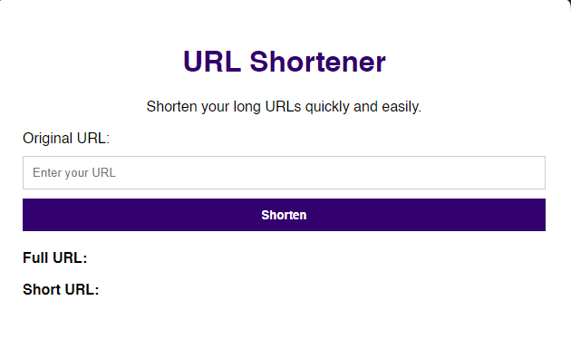

# URL Shortener

URL Shortener is a simple web application that allows you to shorten long URLs, making them easier to share. This project is built using NodeJS, MongoDB and Express, and it provides a user-friendly interface for generating and managing short links.



## Features

- Shorten long URLs with a single click.
- Customizable short URLs for easy sharing.

## Getting Started

### Prerequisites

- Install NodeJs
- Install Express
- Create a MongoDB account
- Create a cluster on MongoDB

### Installation

1. Clone the repository:

   ```bash
   git clone https://github.com/hcastromachado/url-shortener.git


2. Run the command

   ```bash
   yarn install